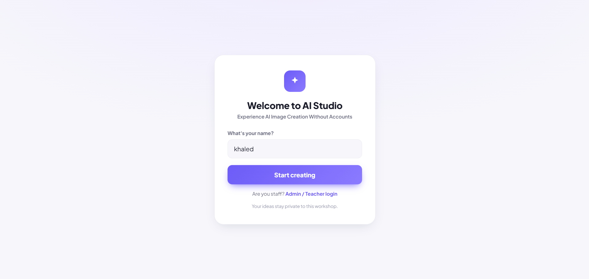
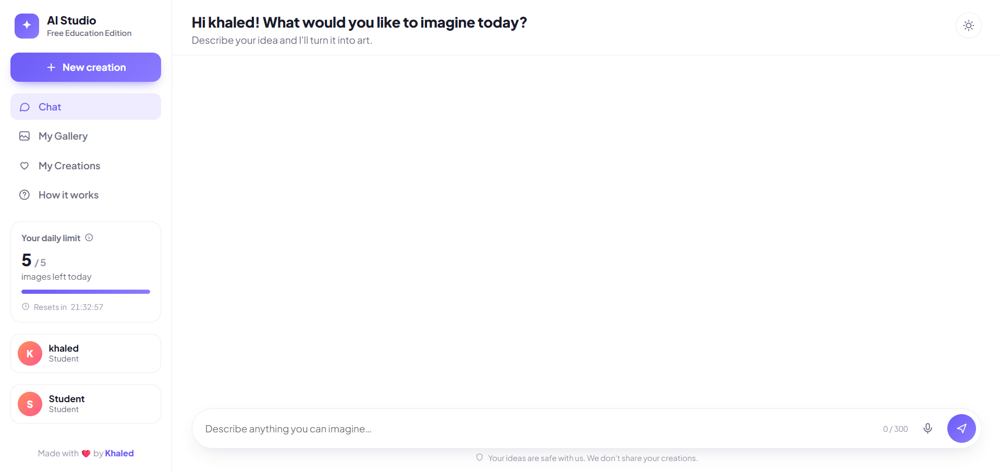
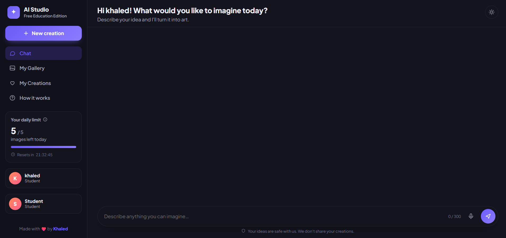
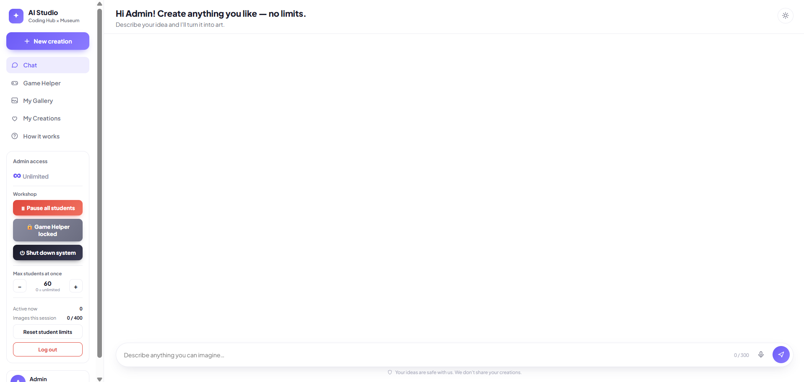

# 🎨 AI Studio - Open Image Generator

An open-source, lightweight web application built to allow students, kids, or public users to experience the magic of AI Image Generation **without needing to create accounts or use their own API keys.** Perfect for classrooms, workshops, or just sharing a safe AI environment with friends. Powered by Google's Gemini API.

## 📸 Screenshots

### Student Interface

<p align="center">
  
</p>

<p align="center">
  
</p>

<p align="center">
  
</p>

### Teacher / Admin Dashboard

<p align="center">
  
</p>

## ✨ Features

- **No Accounts Required:** Users simply enter their name and start generating immediately.
- **Safe & Filtered:** Built-in basic prompt filtering to block inappropriate words and gibberish, keeping the environment safe for students.
- **Smart Quota System:** Limits the number of images each student can generate (e.g., 5 per day) to protect your API billing.
- **Teacher/Admin Dashboard:**
  - Pause or shut down the workshop for everyone with one click.
  - Reset student limits.
  - Monitor active students and total generated images in real-time.
- **Game Helper Mode (Optional):** A dedicated chat tab where students can ask programming or game-development questions.
- **Dark/Light Mode:** Beautiful, responsive UI that works perfectly on desktop and mobile.

## 🚀 Tech Stack

- **Frontend:** Vanilla HTML, CSS, JavaScript (Zero dependencies, incredibly fast).
- **Backend:** Node.js with Express.js.
- **AI Provider:** `@google/genai` (Gemini API).

---

## 🛠️ How to Setup & Run

### 1. Prerequisites

You need to have [Node.js](https://nodejs.org/) installed on your machine.

### 2. Installation

Clone the repository and install the required packages:

```bash
git clone https://github.com/Filx2001/open-ai-canvas.git
cd open-ai-canvas
npm install

```

### 3. Environment Variables

1. Rename the `.env.example` file to `.env`.
2. Get a free API key from [Google AI Studio](https://aistudio.google.com/app/apikey).
3. Open the `.env` file and fill in your details:

```env
GEMINI_API_KEY=your_google_gemini_api_key
ADMIN_KEY=create_a_secure_password_for_admin
TEACHER_KEY=create_a_secure_password_for_teacher

```

### 4. Start the Server

Run the following command to start the app:

```bash
npm start

```

The application will be running at `http://localhost:3000`.

---

## 👨‍🏫 How to use Roles

- **Student:** Just visits the link, types their name, and starts creating.
- **Teacher:** Clicks "Staff login", uses the `TEACHER_KEY`, and can generate unlimited images and reset limits for students.
- **Admin:** Clicks "Staff login", uses the `ADMIN_KEY`, and gets full control (pause the site, lock the chat, change max active users).

## 📄 License

This project is open-source. Feel free to use, modify, and distribute it.

_Made with ❤️ by [Khaled_](https://www.google.com/search?q=https://github.com/Filx2001)
